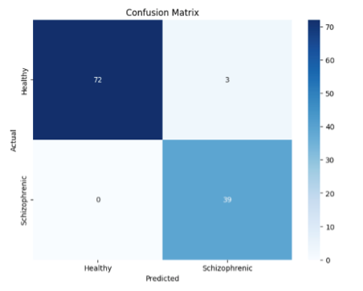
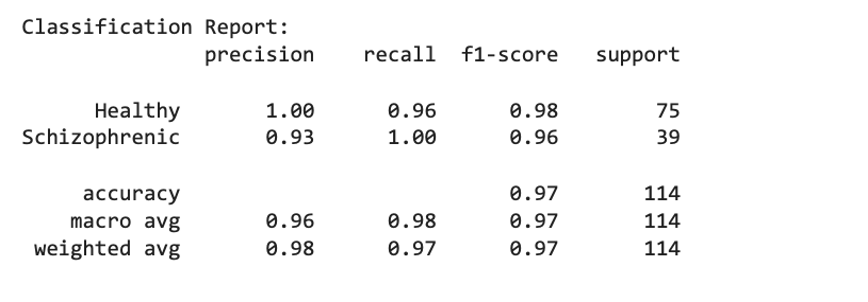

# Schizophrenia Detection using Multimodal Machine Learning and Neuroimaging

This project explores automated schizophrenia detection using multimodal machine learning combining neuroimaging features and behavioural data. Structural MRI datasets were preprocessed using FSL, and multiple machine learning models including CNNs, SVMs, Random Forests, and RNN-based architectures were evaluated.

## Dataset

**Neuroimaging Data**
- Source: OpenNeuro
- Format: NIfTI
- Modality: Structural MRI and Diffusion MRI

**Extracted Features**
- Fractional Anisotropy (FA)
- Mean Diffusivity (MD)
- Diffusion Tensor Imaging metrics

**Behavioral Data**
- Sleep patterns
- Mood disturbances
- Anxiety indicators
- Clinical symptom variables
  
*Note: Raw imaging data is not included due to dataset usage policies.*

  
## Preprocessing Pipeline

### Neuroimaging (FSL-based)

1. AC/PC Alignment
2. Brain Extraction (BET)
3. Eddy Current Correction
4. Diffusion Tensor Fitting (DTIFIT)
5. Tract-Based Spatial Statistics (TBSS)
6. Feature Extraction (FA, MD maps)

### Behavioral Data

- Normalization
- Feature Selection
- Missing Data Imputation

## Machine Learning Models

The following models were implemented and evaluated:

- Support Vector Machine (SVM)
- Random Forest
- Logistic Regression
- Convolutional Neural Networks (CNN)
- Recurrent Neural Networks (RNN)
- Attention-based architectures

## Evaluation Metrics

Model performance was evaluated using:

- Accuracy
- Precision
- Recall
- F1 Score
- Confusion Matrix

## Results

### Confusion Matrix

### Classification Report

### Training and Validation Curves

### Final Model Performance

- Overall Accuracy: **97%**
- Schizophrenia Recall: **1.00**
- Macro F1 Score: **0.97**

The model demonstrated high sensitivity for schizophrenia detection, minimizing false negatives.

## Results Interpretation

- Strong classification performance across both classes.
- No false negatives for schizophrenia cases.
- Minor overfitting observed in training-validation curves.
